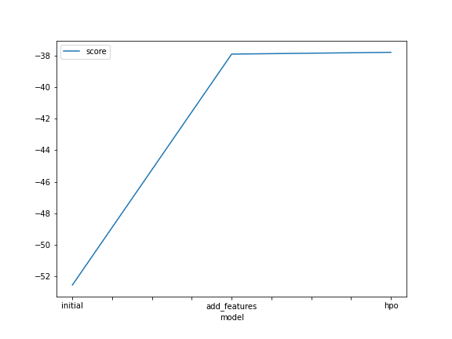
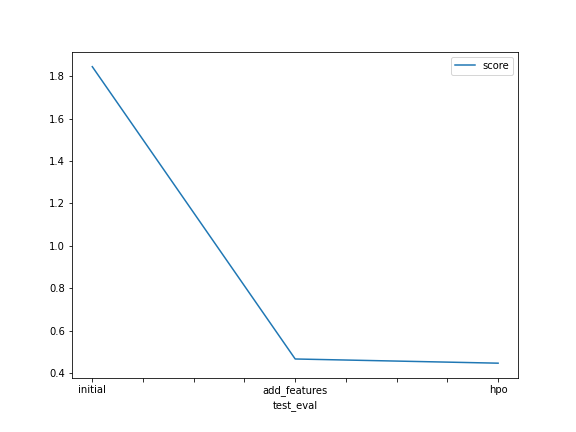

# Report: Predict Bike Sharing Demand with AutoGluon Solution
#### Emilio Renteria Limon

## Initial Training
### What did you realize when you tried to submit your predictions? What changes were needed to the output of the predictor to submit your results?
The first thing that I did was to install kaggle in the notebook, also I used a new fucntion which was .predict() to make a predicitions of all the data from the test.csv, I also upload my credential from kaggle to acces my account, kaggle does not accept negative values for the predictions, so I had to verify that all the values were higher than 0, in this case all the values were higher and there wasn't any change in the prediction values.

### What was the top ranked model that performed?
Thw best model was the first model

## Exploratory data analysis and feature creation
### What did the exploratory analysis find and how did you add additional features?
The first time that I saw the data I review that there were not negative values, and also that some columns could be split in categories or in datetime format
In the second model "additional features" I made the columns "season" and "weather" as category types and it separated in more columns, the date also was split
to make a column for year | month | day | hour | minute | second this to make a more accurate prediction

### How much better did your model preform after adding additional features and why do you think that is?
The model didn't perfom a better prediction, indeed the score drop a lot, from 1.8 to 0.4, I think that this was beacuse the were a lot of columns that could
make more confusse for the prediction, the first hypotesis that I did was that this model would be better than the last one.

## Hyper parameter tuning
### How much better did your model preform after trying different hyper parameters?
The model was a little better than the second one, but the difference wasn't a lot

### If you were given more time with this dataset, where do you think you would spend more time?
I think that perfom a good EDA understanding of which coulums could make a better prediciton like in the first model
and the other part that I think is very important is the part of the hypeparameters becauses in this part the model could get a higher score

### Create a table with the models you ran, the hyperparameters modified, and the kaggle score.
|model|presets|hyperparameters|hyperparameters_tune_kwargs|score|
|--|--|--|--|--|
|initial|best_quality|N/A|N/A|1.84498|
|add_features|best_quality|N/A|N/A|0.46061|
|hpo|high_quality|light|random|0.45829|

### Create a line plot showing the top model score for the three (or more) training runs during the project.

TODO: Replace the image below with your own.

### Create a line plot showing the top kaggle score for the three (or more) prediction submissions during the project.

TODO: Replace the image below with your own.

## Summary
During the project I learnt differents things, the first parte was to apply the EDA to undestrand the model, the first thing that I tried to do was to
view the three csv files that the kaggle dataset, the first thing that I did was to output the format of each file, the next step was to modify the train
csv file to adapt to the same format than the test dataset, the next part that I tried was to test the score of the predictions with the default parameters,
the next part was to develope a new model but with adittional features, changing the type of the coulmns to category and datetime, at first I thought that
all these features would improve the score to a more accurate model, but when I tested the model it had a bad performance, I think that the optimal use could
be testing different features and obtain the higher score to try to work with that, the last part of the project was to develope a third model but in this case
I had to change differents hyperparameters, I changed some values to try to achieve a higher score, I was better but the difference between the second model and
the third model wasn't significant, and the last part was to compare each model and to try to understand what could change to have a better model.
